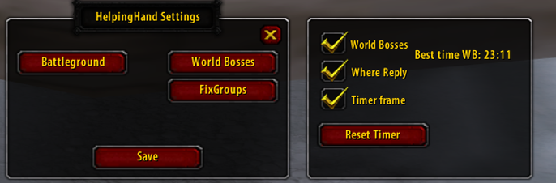
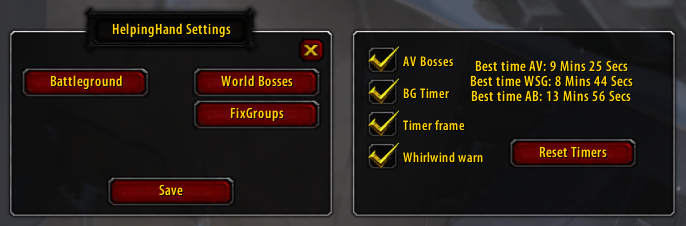

# HelpingHand

### HelpingHand is a World of Warcraft addon designed to provide assistance in tracking world bosses, announcing their abilities, guiding players to the next boss location, and monitoring battleground progress and much more.

### /hhand for settings

## Installation

 1. Download the addon files from GitHub.
 2. Extract the contents of the zip file into your WoW Classic Interface\AddOns\HelpingHand
 3. Launch World of Warcraft and ensure that the addon is enabled in the character selection screen.

## Features
### WorldBosses (you need to be leader/assistant leader)
+ Boss Ability Announcements: When you target a boss it announces is raid about world boss abilities to better prepare for encounters.
+ Navigation Assistance: Announces where to go next after defeating a boss.
+ Navigation Assistance 2: Replies whenever someone writes where in the worldboss raid where to go next.
+ Magic shield warning: Announces in raid when Azuregos magic shield is up/fades.
+ WorldBosses timer (right click to announce the durration)
### Battleground
+ BattleGround Timer: Track the time from the battleground start to the completion of the battleground.
+ BattleGround Timer announce: Announce the time the battleground took.
### Alterac Valley
+ Boss Health Announcements: Announces when Drek/Van health reaches 50%, 30%, 20%, and 10%.
+ WM Whirlwind timer. (right click the timer to announce how long it is until the wm whirlwinds)
+ Announces when GY is up

## Support
For any issues, feedback, or feature requests, please open an issue on the GitHub repository. License This addon is licensed under the MIT License. Feel free to modify and distribute it according to the terms of the license.

# DO NOT USE AUTOFIXGROUPS JUST YET! THIS IS NOT WORKING AS IT SHOULD! THIS IS A BETA RELEASE
