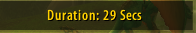
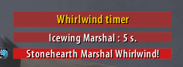

# HelpingHand

HelpingHand is a World of Warcraft addon designed to provide assistance in tracking world bosses, announcing their abilities, guiding players to the next boss location, monitoring battleground progress, and much more.

### Command: `/hhand` for settings

## Installation

1. Download the addon files from GitHub.
2. Extract the contents of the zip file into your WoW Classic `Interface\AddOns\HelpingHand` directory.
3. Launch World of Warcraft and ensure that the addon is enabled in the character selection screen.

## Features

### World Bosses (Leader/Assistant Leader required)
- 
- **Boss Ability Announcements:** Announces world boss abilities in raid when you target a boss to better prepare for encounters.
- **Navigation Assistance:** Announces where to go next after defeating a boss.
- **Navigation Assistance 2:** Replies whenever someone in the raid asks where to go next.
- **Magic Shield Warning:** Announces in raid when Azuregos's magic shield is up or fades.
- **World Bosses Timer:** Right-click to announce the duration.
- 

### Fix Groups
- **Fix Groups:** Clicking `Fixgroups` or using the slash command `/fixgroups` starts to automatically organize groups. Note that this function is not 100% accurate due to the addon not knowing players' specs and other factors.

### Battlegrounds
- **Battleground Timer:** Tracks the time from the start to the completion of the battleground.
- 
- **Battleground Timer Announce:** Announces the battleground duration after completion.
- **Battleground Timer Announce 2:** Right-click the frame to announce the current battleground duration.

### Alterac Valley
- 
- **Boss Health Announcements:** Announces when Drek'Thar/Vanndar Stormpike's health reaches 50%, 30%, 20%, and 10%.
- **Whirlwind Timer:** Right-click the timer to announce the time until the Warmaster's whirlwind.
-  
- **Graveyard Announcements:** Announces when a Graveyard is captured.

## Support
For any issues, feedback, or feature requests, please open an issue on the [GitHub repository](#).

## License
This addon is licensed under the MIT License. Feel free to modify and distribute it according to the terms of the license.

## Important Notice
**DO NOT USE AUTOFIXGROUPS JUST YET! THIS FEATURE IS NOT WORKING AS IT SHOULD! THIS IS AN EARLY RELEASE.**
